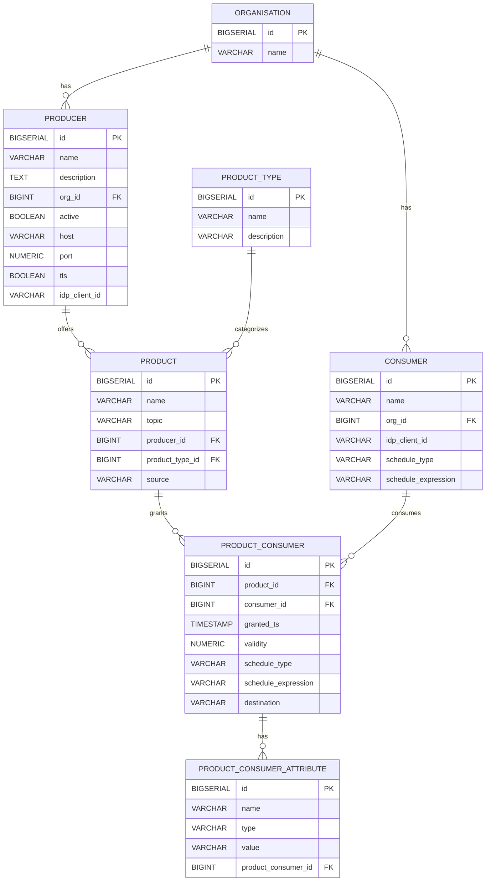

# Database Schema

**Repository:** `management-node`  
**Description:** `Provides APIs to be accessed by Consumer and Producer Federators for the purpose of dynamic configuration management `  
**SPDX-License-Identifier:** `Apache-2.0 AND OGL-UK-3.0 `

---

This document describes the relational database schema used by the Management Node. The schema is applied via Flyway migrations located at:

- `src/main/resources/db/migration/`

The database is designed to model Organisations, their Producers and Consumers, the Products offered by Producers, and the access grants that allow specific Consumers to access specific Products. Additional attributes can be attached to each grant.

## Overview of Entities and Relationships

- Organisation has many Producers and Consumers
- Producer belongs to an Organisation
- Consumer belongs to an Organisation
- Product belongs to a Producer
- Product ↔ Consumer is a many-to-many relationship implemented via the join table `product_consumer`
- Each `product_consumer` (grant) can have many `product_consumer_attribute` rows for extensible metadata

A simple ER diagram (Mermaid):

---

## Tables

### organisation
Represents an organisation that owns Producers and Consumers.

Columns:
- `id` BIGSERIAL, primary key
- `name` VARCHAR(150), not null

Usage:
- Parent entity for `producer` and `consumer`.

---

### producer
Represents a Producer federator/service that offers one or more Products.

Columns:
- `id` BIGSERIAL, primary key
- `name` VARCHAR(50), not null
- `description` TEXT, not null
- `org_id` BIGINT, not null, foreign key → `organisation(id)`
- `active` BOOLEAN, not null
- `host` VARCHAR(500), not null — host or base URL where the producer can be reached
- `port` NUMERIC, not null — network port (stored as numeric)
- `tls` BOOLEAN, not null — whether TLS is required for this endpoint
- `idp_client_id` VARCHAR(50), not null — identity provider client id (e.g., Keycloak). Informational; not an FK

Usage:
- Owns `product` records.
- Links an Organisation to concrete connection details for the Producer.

---

### consumer
Represents a Consumer federator/client that requests access to Products.

Columns:
- `id` BIGSERIAL, primary key
- `name` VARCHAR(50), not null
- `org_id` BIGINT, not null, foreign key → `organisation(id)`
- `idp_client_id` VARCHAR(50), not null — identity provider client id (e.g., Keycloak). Informational; not an FK
- `schedule_type` VARCHAR(100), nullable — type of schedule, e.g., `cron`, `interval`
- `schedule_expression` VARCHAR(255), nullable — schedule expression matching the chosen schedule_type

Usage:
- Participates in access grants via `product_consumer`.
- Optional scheduling metadata for consumer-driven jobs.

---

### product_type
Represents a category/type of Product (e.g., topic-based, file-based).

Columns:
- `id` BIGSERIAL, primary key
- `name` VARCHAR(150), not null
- `description` VARCHAR(255), nullable — brief description of the product type

Usage:
- Lookup table used to categorize products. Initial values seeded by migration: `topic` and `file`.

---

### product
Represents a Product (e.g., a data stream or dataset) offered by a Producer.

Columns:
- `id` BIGSERIAL, primary key
- `name` VARCHAR(50), not null
- `topic` VARCHAR(150), not null — logical topic or channel for the product
- `producer_id` BIGINT, not null, foreign key → `producer(id)`
- `product_type_id` BIGINT, nullable, foreign key → `product_type(id)` — categorization of the product
- `source` VARCHAR(500), nullable — optional source identifier/URI for the product

Usage:
- The resource being granted to Consumers via `product_consumer`.
- Migration defaults existing rows to the `topic` product type.

---

### product_consumer
Join table representing an access grant that allows a Consumer to access a Product.

Columns:
- `id` BIGSERIAL, primary key
- `product_id` BIGINT, not null, foreign key → `product(id)`
- `consumer_id` BIGINT, not null, foreign key → `consumer(id)`
- `granted_ts` TIMESTAMP, not null — timestamp when access was granted
- `validity` NUMERIC, not null — validity period/units are application-defined
- `schedule_type` VARCHAR(100), nullable — e.g., `cron`, `interval`
- `schedule_expression` VARCHAR(255), nullable — expression matching the schedule_type
- `destination` VARCHAR(500), nullable — optional destination identifier/URI for scheduled deliveries
- `uq_product_consumer_pair` UNIQUE (`product_id`, `consumer_id`) — ensures one grant per pair

Notes:
- Originally used a composite primary key (`product_id`, `consumer_id`); later replaced by surrogate `id` while preserving uniqueness via `uq_product_consumer_pair`.

Usage:
- Central record for authorization decisions: which Consumer can access which Product and since when.
- Optional scheduling metadata for grant-level processing/delivery.

---

### product_consumer_attribute
Extensible attributes attached to a specific `product_consumer` grant (key/value-like rows with a simple type field).

Columns:
- `id` BIGSERIAL, primary key
- `name` VARCHAR(150), not null — attribute name/key
- `type` VARCHAR(50), not null — attribute type (string indicator)
- `value` VARCHAR(500), not null — attribute value
- `product_consumer_id` BIGINT, not null, foreign key → `product_consumer(id)`

Usage:
- Store additional constraints or metadata for a grant (e.g., scopes, rate limits, contractual flags). Semantics are defined by application logic.

---

## Migration Notes
- Schema is versioned and applied with Flyway on application startup.
- Foreign keys enforce referential integrity among core entities.
- Consider adding database indexes on foreign key columns (`producer.producer_id`, `consumer.org_id`, `product.producer_id`, `product_consumer.product_id`, `product_consumer.consumer_id`, `product_consumer_attribute.product_consumer_id`) to optimize query performance.

## Data Protection and Security
- Identity fields like `idp_client_id` are not foreign keys; they link to external IdP configuration (e.g., Keycloak) at the application layer.
- Ensure that any PII or sensitive metadata stored in attributes follows your organization’s data handling policies.